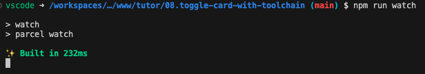
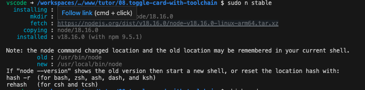
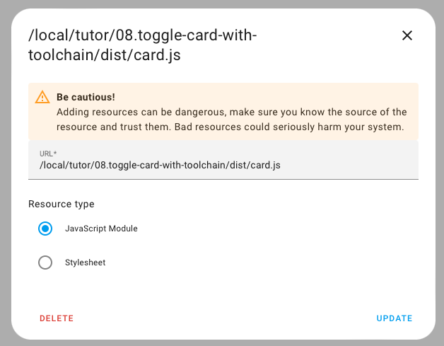
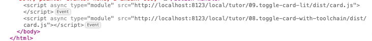

[](https://github.com/hacs/integration)

# Toggle Card With a Toolchain



Adding *Nodejs*, *Npm* and the bundler *Parcel*.

***

* @published: May 2023
* @author: Elmar Hinz
* @name: `toggle-card-with-toolchain`
* @id: `tcwt`

You learn:

* how to install nodejs and npm into the development container
* how to update them to recent versions
* how to use npm (the basics)
* how to install *Parcel*
* how to setup and organize the projects layout
* how to inline *HTML* and *CSS* files

## Goal

Installing a typical toolchain for frontend development based on `node` and
`npm`, adjusting the layout of the directories and running the toolchain.

## Prerequisites

* previous tutorial to build upon (tutorial 07)
* adding entities, cards and resources (tutorial 04, 02)
* setting up the core developers container (tutorial 01)

## About

A simple javascript file does not address advanced requirements. Instead
you will generate code from a source folder into a target folder by using
the toolchain. By convention the names are `src/` and `dist/`.

## Usage

While writing this tutorial I set up the project step by step to test
everything and to document it in a usable order. Alongside with with the
README I ship final runnable result of the files. I can't ship the intermediate
steps, though.

You have three options how to use this tutorial. It's your decision how deep
you want to dive.

1. Reading as documentation

    You can just read it as a kind of documentation.

2. cloning and running the repository

    You can fork and/or clone it to inspect and run the final result. Even if
    you take this approach you will need to set up the tools to run them. In
    this case mind to run `npm install` after cloning to install the libraries.

3. step by step

    You can follow along and do everything from scratch to experience the full
    setup of a project. Start by copying the the file `card.js` from the
    previous tutorial and adjust the names of the class and identifiers to match
    this tutorial.  Staying with the previous identifiers may work also but
    could cause confusion and conflicts.

If you want more advice, just do all three steps. First skim-read the tutorial
to see what it is about. Then do the installation of *node* and *npm* to be able
to run the cloned repo. Then try and learn to set up your own project.

## Setup

### Installing node and npm inside the core developers container

`apt` is the package manager of Debian. It does install stable versions.
Sometimes they are rather outdated. The *node package manager* `npm` is the
package manager to run the project. It manages node modules and their large
dependency tree.

Open a shell and run the following commands.

```sh
    sudo apt update
    sudo apt install npm
```

Check that node and npm have been installed by checking their versions.

```sh
    node -v
    npm -v
```


Unfortunately this versions on Debian are outdated and will not work for recent
packages. We use `npm` to update `node.js` and `npm` themselves.

```sh
    sudo npm cache clean -f
    sudo npm install -g n
```

This globally installs the module `n`, which is a [version manager for
`node.js`](https://github.com/tj/n). Then install the current stable version.

```sh
    sudo n stable
```

You may also want to try the latest version.

```sh
    sudo n latest
```

Take care the shell gets the new path as explained in the shell's output.



Check that you got more recent versions.

```sh
    node -v
    npm -v
```

### Directories

Create the directories `src/` and `dist/`. The latter would be created by the
toolchain. Just do it for sake of awareness. You can delete the directory
`dist/` any time to test the build process is fully working.

In some scenarios you may want to ignore the `dist/` directory in `.gitignore`
as it holds generated stuff. If you run a *HACS* repository you have to commit
it on the other hand. Mind that there is an additional `dist/` in the path now,
when you register the card as a resource.

### HACS

If you run a custom HACS repository, set `content_in_root` to `false`, to use
the default location `dist/` now.

```json
{
    "name": "Toggle card with toolchain",
    "render_readme": true,
    "filename": "card.js",
    "content_in_root": false
}
```

### Package management

We don't do the typical `npm init` call. It generates information, that is
targeted for libraries that are published to the *NPM Registry*. HACS retrieves
its information from the settings of the repository on Github. A minimal
`package.json` will be auto created anyway as soon as we install packages.

Let's try by installing the bundler `parcel`.

```sh
    npm install --save-dev parcel
```

The option `--save-dev` tells that this is a management tool. It should not go
into `card.js` itself. A file `package.json` has been created reflecting this.

```json
{
  "devDependencies": {
    "parcel": "^2.8.3"
  }
}
```

There is also a file `package-lock.json`. It describes all the dependencies that
have been downloaded for packages in `package.json` and all the versions that
have been resolved for them. It's important to commit this file to the git
repository.

The downloaded libraries have been installed into a folder named `node_modules`.
You may want to ignore this folder by an entry to `.gitignore` for not to push
all the heavy stuff to Github. If you cloned a repository from Github you run
`npm install`. This installs all libraries into `node_modules` again just as
defined in `package-lock.json`.

## Running the toolchain

### Parcel

Many developers are used to the bundler *Webpack*. Why
[*Parcel*](https://parceljs.org/) now? The answer is, to keep this tutorial
short and easy. We can run *Parcel* without setting up any configuration. It is
so much easier to get started.

You have placed your `card.js` file into the `src/` folder. Let's see how to
bring it to the `dist/` folder. If you want to follow along step by step, you can
copy a standalone `card.js` from a previous tutorial. If you forked this
tutorial `card.js` will draw in the other files already. That's just as fine.

```sh
npx parcel src/card.js
```

`npx` is a `npm` shortcut to run executables. It's equivalent to calling this
command:

```sh
./node_modules/parcel/lib/bin.js src/card.js
```

The file `dist/card.js` get's created. Not only that. The sources are watched.
Whenever one of the sourcefile is edited `dist/card.js` gets regenerated.
A hard reload of the browser is still required.

For sure you have to register the card before as a resource. Mind the new
subdirectory `dist/` is now part of the path.



Open `dist/card.js` in the editor to get an idea. You observe that the bundler
not only just did copy the file.

There is also a directory `.parcel-cache` to speed up the process. You should
exclude this from being added to git.

You can customize `package.json` with script entries to gain some comfort. You
call them as `npm run watch` and `npm rum build`.

```json
{
  "source": "src/card.js",
  "main": "dist/card.js",
  "scripts": {
    "watch": "parcel watch",
    "build": "parcel build"
  },
  [ ... ]
}
```



An investigation of the HTML source of the dashboard reveals, that the script is
included as a module. Exports and imports are possible. We will need them in the
next tutorial. We need to modify `package.json` to produce a module.

  ```json
  [...]
  "source": "src/card.js",
  "module": "dist/card.js",
  "targets": {
    "module": {
      "includeNodeModules": true
    }
  },
  [...]
  ```

By setting `includeNodeModules` to `true` the output will still be a single
`card.js` file with all required libraries included.

Visit the documentation of [*Parcel*](https://parceljs.org/docs/) to get more
ideas.

### Bundling

Now that the bundler is up and running, let's bundle!

`card.js` has grown large. We split it up into multiple parts.

```sh
src/index.js
src/card.js
src/card.html
src/card.css
src/editor.js
src/editor.html
src/editor.css
```

#### Importing JS

In `package.json` set the `source` to `src/index.js`. We use this file as
entrypoint to import the other files.

  ```json
  "source": "src/index.js",
  ```

If you want to run `parcel` directly also notice this change.

```sh
npx parcel src/index.js
```

At this point I recommend to use the scripts configured in `package.json`.  I
didn't investigate how far `parcel` will respect the settings from
`package.json` when running it directly. In case please refer to the docs.

Imports in `src/index.js`:

```js
import { ToggleCardWithToolchain } from "./card";
import { ToggleCardWithToolchainEditor } from "./editor";

customElements.define(
    "toggle-card-with-toolchain",
    ToggleCardWithToolchain
);
customElements.define(
    "toggle-card-with-toolchain-editor",
    ToggleCardWithToolchainEditor
);

window.customCards = window.customCards || [];
window.customCards.push({
    type: "toggle-card-with-toolchain",
    name: "toggle card created with a toolchain",
    description: "Turn an entity on and off",
});
```

The classes get an `export` declaration. The file `card.js` only holds
the class of the card now. Handle `editor.js` accordingly.

```js
export class ToggleCardWithToolchain extends HTMLElement {
    [ ... ]
}
```

#### Importing CSS

Write the CSS of `card.js` into `card.css`. It is imported like this into
`card.js`.

```js
import css from "bundle-text:./card.css";
```

The method `doStyle` gets reduced.

```js
    doStyle() {
        this._elements.style = document.createElement("style");
        this._elements.style.textContent = css;
    }
```

That's all. The editor is done the same way.

#### Importing HTML

We take the same approach. I use an "importBox" trick to be able to place the
full HTML into `card.html` including the root tag.

```html
<ha-card>
    <div class="card-content">
        <p class="error error hidden">
        <dl class="dl">
            <dt class="dt"></dt>
            <dd class="dd">
                <span class="toggle">
                    <span class="button"></span>
                </span>
                <span class="value">
                </span>
            </dd>
        </dl>
    </div>
</ha-card>
```

```js
import html from "bundle-text:./card.html";
[...]
doHtml() {
    const importBox = document.createElement("div");
    importBox.innerHTML = html;
    this._elements.card = importBox.firstElementChild;
}
```

The editor is done the same way.

See the documentation to learn more about
[inlining](https://parceljs.org/features/bundle-inlining/) with *Parcel*.

### Importing NPM libraries

Once a library is installed with NPM you can import it right away. We will
do this in the next tutorial with the `Lit` library. To jump a little ahead it
will look like this.

* Installation: `npm add lit`
* Import `import { html, LitElement, nothing } from 'lit'`

## Where is the toolchain?

You may ask. You have only seen one tool, *Parcel*?

Well, you could already count `node` and `npm` into the toolchain, too. The
point is, that *Parcel* automagically manages the toolchain to a certain extend.
In our example it has silently added a module to `package.json` to inline the
*CSS* and *HTML* files.

  ```js
  "devDependencies": {
    "@parcel/transformer-inline-string": "^2.8.3",
    "parcel": "^2.8.3"
  }
  ```

To learn all about *Parcel* [please consult the
docs](https://parceljs.org/docs/).